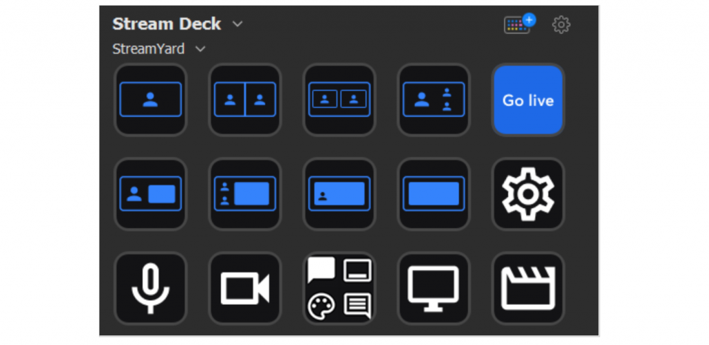

# Blazm.Hid
Blazm.Hid is a library for Blazor that makes it possible to connect to and communicate with HID devices (Human Interaction Device).
There are many devices that can be connected to a computer, such as a Stream Deck, Kuando Busylight and many more.
In this demo we will take a look at how to connect to a device and send and receive data.
## Add HidNavigator
1. Add HidNavigator in startup.cs
    ```csharp
    services.AddScoped<HidNavigator>();
    ```
2. In Index.razor inject HidNavigator
    ```csharp
    @inject HidNavigator navigator;
    ```
3. Add filter
    ```csharp
    private List<HidDeviceFilter> _filters=new();
    ```
4. Add device
    ```csharp
    HidDevice myDevice;
    List<HidDevice> devices=new();
    ```
Here we have one specific device as well as a list of devices.
WebHID has the ability to list devices that you have granted access to. That API does not exist for Bluetooth.

5. Implement ListDevices
    ```csharp
     public async Task ListDevices()
     {
         devices=await navigator.GetDevicesAsync();
     }
    ```
6. Implement connect
    ```csharp
     public async Task Connect()
     {
         _filters.Add(new HidDeviceFilter() {vendorId = 10171 }); //Add BusyLight

         var filter = new HidDeviceRequestOptions() { filters = _filters.ToArray() };
         myDevice=await navigator.RequestDeviceAsync(filter);
     }
    ```
7. Add Buttons
    ```html
    <button @onclick="ListDevices"> List Devices </button>
    <button @onclick="Connect"> Connect </button>
    ```
8. Add List
    ```csharp
    <br/>
    <br/>
    @foreach(var d in devices)
    {
        @d.ProductName<br/>
    }
    ```
## Busylight
Kuando Busylight is a device that can be used to light up a device if you are, as the name implies, busy.
We can get the API from Kuando and use it to connect to the device.
It's a very interesting device because it can have up to 8 command, and a command can run multiple times and even jump to a different command.
I won't go into details how that work, but I have the source on my GitHub so you can take a look.
1. Show the color
    ```csharp
    string Color { get; set; } = "#000000";
    ```
    This is the variable that holds the color.
2. Show list devices and connect
    ```csharp
    List<BusyLightCommand> Commands = new();
    public async Task ListDevices()
    {
        devices=await navigator.GetDevicesAsync();
    }
  
    public async Task Connect()
    {
        _filters.Add(new HidDeviceFilter() {vendorId = 10171 }); //Add BusyLight

        var filter = new HidDeviceRequestOptions() { filters = _filters.ToArray() };
        myDevice=await navigator.RequestDeviceAsync(filter);

        await myDevice.OpenAsync();
    }
    ```
3. Show Change color
    This method is where the magic happens, we create on command, just turning the light what ever color I have chosen in the colorpicker.
    ```csharp
     async Task ChangeColor()
     {
         Commands.Clear();


         var hexString = Color.Substring(1);
         var r = int.Parse(hexString.Substring(0, 2), NumberStyles.AllowHexSpecifier);
         var g = int.Parse(hexString.Substring(2, 2), NumberStyles.AllowHexSpecifier);
         var b = int.Parse(hexString.Substring(4, 2), NumberStyles.AllowHexSpecifier);

         BusyLightCommand Step1 = new BusyLightCommand();
         Step1.Command = 0x10; //Reset Device and jump to step 2
         Step1.Repeat = 0;
         Step1.Red = (byte)((Convert.ToDecimal(r)/255)*100);
         Step1.Green = (byte)((Convert.ToDecimal(g)/255)*100);
         Step1.Blue = (byte)((Convert.ToDecimal(b)/255)*100);
         //Step1.OnTime = 10;
         //Step1.OffTime = 5;

         Commands.Add(Step1);

         await SendCommand();
     }
    ```
4. Show SendCommand
    This method is the on that created a command array with checksums and so on and sends it to the device.
    If we want it to keep being lit up we need to continue sending ir keep alive signals, I haven't implemented thad in this demo.
    ```csharp
    public async Task SendCommand()
    {
        var buffer = new byte[64];
        var index = 0;
        foreach(var command in Commands)
        {
            command.GetCommandBytes().CopyTo(buffer, index);
            index += 8;
        }

        //Unused
        buffer[59] = 0xff;
        buffer[60] = 0xff;
        buffer[61] = 0xff;

        var checksum = 0;
        for (var i = 0; i <= 61; i++) {
            checksum += buffer[i];
        }
        buffer[62] = (byte)((checksum >> 8) & 0xffff);
        buffer[63] = (byte)(checksum % 256);

        await myDevice.SendReportAsync(0, buffer);
    }
    ```
5. Show BusyLightCommand
    The busy light command is just a class with all the different colors, sounds, jumps and so on
    ```csharp
    public class BusyLightCommand
    {
        /// <summary>
        /// bitwise interpretation:
        /// 0b1000xxxx: Keep alive signal = no change. xxxx = timeout in seconds.
        /// 0b01000000: Start Bootloader command
        /// 0b00100000: Reset Device command
        /// 0b00010aaa: Jump to step aaa when the step is executed.
        /// </summary>
    
        public byte Command { get; set; }
        /// <summary>
        /// Execute this step for repeat number of times [1..255]
        /// </summary>
        public byte Repeat { get; set; }
        /// <summary>
        /// RED LED intensity expressed as PWM on time [0..100] 0-100%
        /// </summary>
        public byte Red { get; set; }
        /// <summary>
        /// GREEN LED intensity expressed as PWM on time [0..100] <=> 0-100%
        /// </summary>
        public byte Green { get; set; }
        /// <summary>
        /// BLUE LED intensity expressed as PWM on time [0..100] <=> 0-100%
        /// </summary>
        public byte Blue { get; set; }
        /// <summary>
        /// ON time in 0.1 second steps [0..255] <=> 0-25.5sec
        /// </summary>
        public byte OnTime { get; set; }
        /// <summary>
        /// OFF time in 0.1 second steps [0..255] <=> 0-25.5sec
        /// </summary>
        public byte OffTime { get; set; }
    
        /// <summary>
        ///bitwise interpretation: 0bcbbbbeee
        /// bbbb is the ringtone/IM alert tone number to be played.
        /// If bit c = 1 the audio setting is changed.
        /// if bit c = 0 the audio setting is ignored.
        /// The volume level is defined by bits eee. Setting eee=000 stops
        /// playing the ringtone. Setting eee=111 is the highest volume level.
        /// There might be fewer than 16 ringtones/IM alert tones available.
        /// Selecting an undefined ringtone is just ignored.
        /// Ringtones are repeated automatically.
        /// </summary>
        public byte Ringtone { get; set; }

        public byte[] GetCommandBytes()
        {
            return new byte[] { Command, Repeat, Red, Green, Blue, OnTime, OffTime, Ringtone };
        }
    }
    ```

## Stream deck
The stream deck is a device with a bunch of buttons and each button is also a screen.
It is very customizeable and can control almost anything.
I use it for controling Visual Studio, Office or when we are streaming.
I have even used it during this presentation.
Imagine that you have a service, a website that can offer your users Stream deck integration.
As soon as you connect to the streamdeck it changes the view and you can now control the website.
The only downside is that is takes over control from your software, and they now battle (or listen) to the same buttons.
So for this to work 100% we need to turn off the elgato software.
But for this demo I have a couple of buttons that is not mapped that I can use.
1. Show the buttons
    ```csharp 
    bool[] Buttons = new bool[15];  
    ```
    Here we have an array with 15 buttons since the device I am using is a medium Stream Deck with 15 buttons.
2. Show the buttons loop
    ```csharp
     @foreach(var b in Buttons)
     {
         <div style="border:solid 1px black">@b</div>   
     }
    ```
3. Show the connect method
    There is really nothing new with the connect method exept for the notification handler.
    ```Csharp
        myDevice.Notification += Input_Notification;
    ```
4. Show the Input_Notification
    ```Csharp
    private void Input_Notification(object sender, OnInputReportArgs e)
    {
        if (e.ReportId == 0x01)
        {
            for (int button= 3; button < 18;button++)
            {
                if (e.Data[button] == 0x01)
                {
                    Console.WriteLine($"Button {button - 2} is pressed");
                    Buttons[button - 3] = true;
                }
                else
                {
                    Buttons[button - 3] = false;
                }
            }
            StateHasChanged();
        }
    }
    ```
This code might look a bit odd but the first couple of bytes in the notification are not buttons.
We get a list of all buttons so we could press more than one.

So where could we use this?
We use StreamYard when we stream, it's an easy way to get the video saved as well as bring in guests and questions.
StreamYard has a Stream deck profile you can download from their site.
The limitation of that is that the web browser window need to be selected (since is just sends key strokes to the active window).
If they would offer a functionality where they connect to my stream deck, I wouldn't need to download the profile beforhand and I wouldn't have to have the window selected.

I will continue to evolve this library with more fun examples, if you have any suggestions or want to help out feel free to contact me.